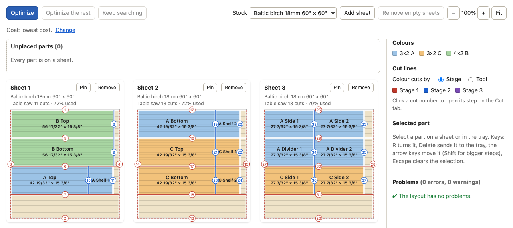

# OpenCutPlan

**Use it now: <https://blakemcanally.github.io/open-cut-plan/>**

OpenCutPlan plans how to cut plywood and other sheet goods into the parts of a project. It runs in your browser. It
has no account and no server: your projects stay in the browser's storage and in the `.cutplan.json` files that you
save.



## What it does

- **Designs.** Describe a KALLAX-style or EKET-style unit, or a custom grid of cells. Combine cells into one larger
  cell. The app makes the parts, checks the design, and estimates the sheets.
- **Parts, stock, and tools.** Type or paste the parts, or import a CSV file. Lengths accept fractions, feet, and
  millimetres. Add the sheets that you buy and the offcuts that you own. Add your saws: table saw, track saw, circular
  saw, panel saw, or mitre saw, each with its kerf and limits.
- **Optimizer.** Choose a goal: lowest cost, best offcuts, or fewest cuts. By default, the optimizer puts the parts of
  each unit on as few sheets as possible. Parts that ask for a factory edge get one, the longest parts first. You can
  pin a sheet, plan only the parts that are not on a sheet, keep searching, and undo a run.
- **Layout editor.** Drag parts between sheets, with snapping. Turn and move parts with the keyboard. The problems
  list names each overlap, each part past the edge of the sheet, and each cut that no saw can make.
- **Cut sequence.** On the Cut tab, follow the cuts at the saw, step by step, in the order of the sheets or in the
  order of the saw settings. Each step tells which piece to pick up, which tool to use, and where each piece goes.
  Your ticks stay in the project file.
- **Assembly steps.** On the Assembly tab, each design gives a list of assembly steps, with a box to tick for each
  step. A front view for each step shows the boards of the step and the marks to make.
- **Reports.** A summary of the plan, a shopping list with costs, a cut list, the offcuts, and the hardware to buy.
- **Printing.** Print a booklet with a shopping list, sheet diagrams, the cut sequence, and the assembly steps. Print
  part labels. Export CSV files and SVG drawings.
- **Material catalogue.** Add common sheet goods and sizes, with typical, dated prices.
- **Command line.** The `opencutplan` command does the same work in scripts and for AI agents.
- **Phone.** The app works on a narrow screen, so you can use it at the saw.

## Quick start

Open <https://blakemcanally.github.io/open-cut-plan/> and click **Open example** on the home screen. Or click **New
project** and start with the Design tab or the Parts tab.

To run the app on your computer, you need Node.js 24 or later. The repository pins the version in `.nvmrc`, so `nvm
use` or `fnm use` selects it.

```bash
git clone https://github.com/blakemcanally/open-cut-plan.git
cd open-cut-plan
npm ci
npm run dev        # open http://localhost:5173
npm run check      # lockfile, lint, typecheck, unit tests, and build
```

## Command line

The `opencutplan` command creates, changes, checks, optimizes, and reports on project files. Each command has a
`--json` result and a fixed exit code, so scripts and AI agents can use it. The package is not on npm, so run the
command in a clone of this repository after `npm ci`. See [`docs/cli.md`](docs/cli.md).

```bash
npx opencutplan new desk.cutplan.json --name "Desk" --units in
npx opencutplan materials add desk.cutplan.json --name "Plywood 3/4" --thickness 3/4
npx opencutplan stock add desk.cutplan.json --length "8'" --width "4'" --cost 60
npx opencutplan parts add desk.cutplan.json --name Top --length 60 --width 30
npx opencutplan optimize desk.cutplan.json --iterations 200
npx opencutplan report shopping desk.cutplan.json
npx opencutplan help
```

## Documentation

- **Web app:** [`docs/web-app.md`](docs/web-app.md) — the screens, the layout editor and its keys, the cut and
  assembly checklists, reports, printing, and where projects are stored.
- **Command line:** [`docs/cli.md`](docs/cli.md) — the `opencutplan` command for scripts and AI agents.
- **File format:** [`docs/format.md`](docs/format.md) and the JSON Schema in [`schema/`](schema/).
- **Cut analysis:** [`docs/cut-analysis.md`](docs/cut-analysis.md) — the layout validator, guillotine cut tree, tool
  rules, cut sequence, offcuts, and reports.
- **Optimizer:** [`docs/optimizer.md`](docs/optimizer.md) — plan generation, the objective, pinning, and the worker
  protocol.
- **Catalogue:** [`docs/catalog.md`](docs/catalog.md) — common sheet goods and sizes with typical, dated prices.
- **Examples:** [`examples/`](examples/) — `living-room-shelf` (inches, with a full layout),
  `simple-bookcase-mm` (metric, with an owned offcut and two saws), `kallax-2x4-mm` (a KALLAX-style design),
  `kallax-4x2-combined-mm` (a KALLAX-style design with two cells combined), and `eket-wall-in` (two EKET-style wall
  units, in inches).
- **Backlog:** [`docs/backlog.md`](docs/backlog.md) — requests and their status.
- **Design:** [`docs/superpowers/specs/`](docs/superpowers/specs/).

## Development

The repository is a TypeScript monorepo. `packages/core` has the file format, CSV, cut analysis, and the optimizer.
`packages/cli` has the `opencutplan` command. `apps/web` has the web app (React and Vite). `npm ci` and `npm install`
stop with an error on a Node.js version older than 24.

| Command | What it does |
| ------- | ------------ |
| `npm run dev` | Starts the web app at http://localhost:5173, with hot reload. |
| `npm run check` | Checks the lockfile, lints, typechecks, runs all unit tests, and builds the web app. Run it before you push. |
| `npm test` | Runs the unit tests of all packages with Vitest. |
| `npm run typecheck` | Typechecks all packages, the examples, the scripts, and the end-to-end tests. |
| `npm run build` | Builds the web app into `apps/web/dist`. |
| `npm run preview` | Serves `apps/web/dist` at http://localhost:4173, as a static host serves it. |
| `npm run e2e:install` | Downloads Chromium for the end-to-end tests. Run it once. |
| `npm run e2e` | Builds the web app and runs the Playwright end-to-end tests. |
| `npm run lint` | Lints with oxlint, with type-aware rules (config: `.oxlintrc.json`). |
| `npm run cli -- …` | Runs the `opencutplan` command. |
| `npm run schema` | Regenerates `schema/cutplan.schema.json` after a change to the format. |
| `npm run examples` | Regenerates the files in `examples/` after a change to a builder. |
| `npm run lockfile` | Makes sure that `package-lock.json` resolves every package from the public npm registry. Add `-- --fix` to rewrite the URLs of a private mirror. |

### CI and deploy

The web app is a static site. The `CI` workflow ([`.github/workflows/ci.yml`](.github/workflows/ci.yml)) runs `npm
run check` and the end-to-end tests on each push and pull request. On a push to `main`, it also publishes
`apps/web/dist` to GitHub Pages, at <https://blakemcanally.github.io/open-cut-plan/>. The build uses relative paths
and hash routes, so it works at `https://<owner>.github.io/<repo>/` with no change. To turn on the deploy in a fork,
set **Settings → Pages → Source** to **GitHub Actions** once.

## License

OpenCutPlan is free software: you can redistribute it and/or modify it under the terms of the GNU General Public
License as published by the Free Software Foundation, either version 3 of the License, or (at your option) any later
version. See [`LICENSE`](LICENSE).
